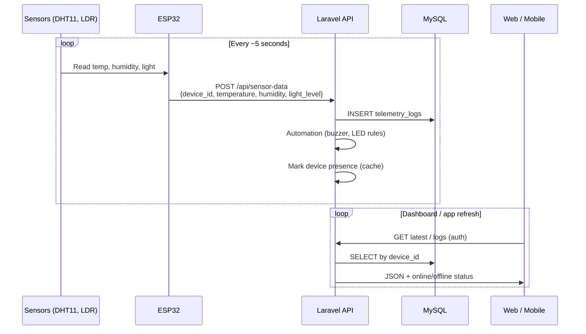
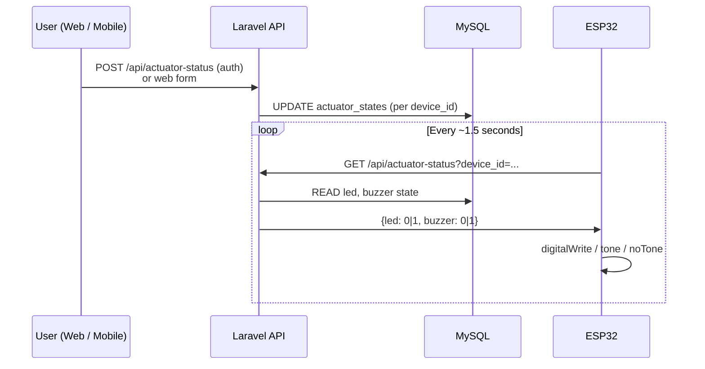

# Smart Room IoT — Project Documentation

**Course submission reference** · ESP32 + Laravel + Mobile App  
**Version:** 1.0 · **Stack:** ESP32, Laravel 12, MySQL, Expo (React Native)

---

## 1. Project overview

Smart Room IoT is a **room monitoring and control system**. Sensors on an ESP32 measure temperature, humidity, and light. Data is sent over WiFi to a **Laravel REST API**, stored in a database, and shown on a **web admin dashboard** and **mobile app**. Users can turn the **LED** and **buzzer** on or off remotely; automation rules can also control them based on sensor readings.

### 1.1 Main goals (typical course alignment)

| Goal | How this project addresses it |
|------|-------------------------------|
| IoT hardware (sensors + actuators) | DHT11, LDR, LED, buzzer on ESP32 |
| Wireless connectivity | ESP32 WiFi → HTTP REST |
| Backend server + database | Laravel + MySQL (`telemetry_logs`, `actuator_states`, `users`, `devices`) |
| Web dashboard | Laravel Blade admin UI |
| Mobile application | Expo / React Native (`SmartRoomApp/`) |
| Real-time / near real-time data | ESP32 POST every ~5s; dashboard poll ~3–5s |
| Remote control | LED & buzzer via web + mobile |
| Automation | Temperature → buzzer; light → LED (server + ESP32 local) |
| Multi-room / device identity | Per-room `device_id` (e.g. `SMARTROOM-001`) |
| Security / roles | Admin vs mobile user; Sanctum API tokens |
| Online/offline detection | Presence cache when ESP32 stops posting for a room |

> **Note:** If your instructor provided a `.docx` rubric, paste the bullet list into Section 8 below and tick each item. The `.docx` file was not included in the repository at documentation time.

---

## 2. System architecture

```
┌─────────────────────────────────────────────────────────────────────────────┐
│                           SMART ROOM IoT SYSTEM                              │
└─────────────────────────────────────────────────────────────────────────────┘

  [ DHT11 ]     [ LDR ]                    [ LED ]     [ Buzzer ]
      │           │                            │            │
      └───────────┴──────── ESP32 DevKit ─────┴────────────┘
                          │ WiFi (HTTP)
                          ▼
              ┌───────────────────────┐
              │   Laravel API Server   │
              │   (MySQL database)     │
              └───────────┬───────────┘
                          │
          ┌───────────────┼───────────────┐
          ▼               ▼               ▼
   [ Web Admin ]    [ Mobile App ]    [ ESP32 poll ]
   Browser UI       Expo / RN         GET actuator-status
```

### 2.1 Project folders

| Path | Purpose |
|------|---------|
| `esp32_firmware/smartroom_esp32/` | Arduino sketch for ESP32 |
| `app/`, `routes/`, `database/` | Laravel backend & admin |
| `resources/views/` | Web admin UI (dashboard, logs, actuators, users, devices) |
| `SmartRoomApp/` | Mobile app (Expo Router, `src/app/`, `src/screens/`) |

---

## 3. Hardware components

| Component | Role | ESP32 pin (see `WIRING_GUIDE.md`) |
|-----------|------|-----------------------------------|
| ESP32 DevKit | Main controller, WiFi | — |
| DHT11 | Temperature & humidity | GPIO 4 |
| LDR module | Light level (mapped 0–100%) | GPIO 34 (ADC) |
| LED module | Room light indicator | GPIO 2 |
| Active buzzer | Temperature alarm | GPIO 15 |
| Breadboard + jumpers | Prototyping | — |

---

## 4. End-to-end data flow

### 4.1 Sensor path (ESP32 → database → UI)



**Steps (numbered for reports):**

1. **Collect** — DHT11 and LDR read environment values.  
2. **Package** — ESP32 builds JSON with `device_id` (must match registered room, e.g. `SMARTROOM-003`).  
3. **Transmit** — `POST http://<server>:8000/api/sensor-data` over WiFi.  
4. **Store** — Laravel saves row in `telemetry_logs`.  
5. **Automate** — Server may set buzzer/LED in `actuator_states` (see Section 6).  
6. **Display** — Admin dashboard and mobile app show metrics, charts, and logs.  
7. **Presence** — If no POST for that `device_id` within ~25 seconds, room shows **Offline**.

### 4.2 Actuator path (user → ESP32)



**Steps:**

1. User toggles LED or buzzer on **web** or **mobile**.  
2. Laravel stores state in `actuator_states` for that `device_id`.  
3. ESP32 polls `GET /api/actuator-status?device_id=<firmware ID>`.  
4. ESP32 applies LED/buzzer on the physical pins.

### 4.3 Local automation on ESP32 (optional backup)

Even if the server is slow, ESP32 runs local rules after each sensor read:

- Light &lt; 40% → LED ON; light &gt; 60% → LED OFF  
- Temperature &gt; 33°C → buzzer ON; &lt; 33°C → buzzer OFF  

Server-side rules mirror this for consistency when data is received via API.

---

## 5. Software modules & user roles

### 5.1 Roles

| Role | Access |
|------|--------|
| **Admin** | Web: dashboard (all rooms via dropdown), logs, actuators, register devices, manage users. API: rooms list, user/device management. |
| **Mobile user** | App: login → link `device_id` → dashboard, controls, logs, alerts, profile. Sees **only** their linked room. |

### 5.2 Device ID workflow (multi-room)

1. Admin registers IDs under **Devices** (e.g. `SMARTROOM-001`, `SMARTROOM-003`).  
2. Admin sets `deviceId` in ESP32 firmware to match one ID and flashes the board.  
3. Admin creates mobile user accounts (no device pre-assigned).  
4. Mobile user logs in → **Link device** screen → enters same ID as ESP32.  
5. Admin uses **Monitor room** on dashboard to view any registered room.  
6. **Online** = ESP32 recently posted as that ID; **Offline** = no recent POST for that ID.

### 5.3 Default admin (after seed)

- Email: `admin@smartroom.local`  
- Password: `password` (change in production)

---

## 6. Automation rules

| Condition | Action | Where |
|-----------|--------|--------|
| `temperature > 33°C` | Buzzer ON | Laravel on POST; ESP32 local |
| `temperature < 33°C` | Buzzer OFF | Laravel on POST; ESP32 local |
| `light_level < 40` | LED ON | Laravel on POST; ESP32 local |
| `light_level > 60` | LED OFF | Laravel on POST; ESP32 local |

Alert labels on UI: high temp (&gt;35°C), warning (&gt;30°C or bright light), normal otherwise.

---

## 7. API reference (summary)

### 7.1 Public (ESP32, no token)

| Method | Endpoint | Description |
|--------|----------|-------------|
| POST | `/api/sensor-data` | Store reading `{device_id, temperature, humidity, light_level}` |
| GET | `/api/actuator-status?device_id=` | Poll LED/buzzer state |
| GET | `/api/time` | Server time sync |

### 7.2 Mobile (Bearer token — Sanctum)

| Method | Endpoint | Description |
|--------|----------|-------------|
| POST | `/api/login` | Username + password → token |
| GET | `/api/sensor-data/latest` | Latest reading for user’s room |
| GET | `/api/sensor-data` | Paginated history |
| POST | `/api/actuator-status` | Set LED/buzzer |
| GET/POST | `/api/device/link`, `/linkable`, `/unlink`, `/status` | Device linking |

### 7.3 Web (session)

| Route | Description |
|-------|-------------|
| `/dashboard` | Live metrics, chart, actuators, recent logs |
| `/dashboard/presence` | JSON online status (polling) |
| `/dashboard/logs` | Full telemetry history + filters |
| `/dashboard/actuators` | Per-room actuator control |
| `/devices`, `/users` | Admin registry (admin only) |

---

## 8. Database tables

| Table | Purpose |
|-------|---------|
| `telemetry_logs` | Sensor history (`device_id`, temp, humidity, light, timestamps) |
| `actuator_states` | LED/buzzer per `device_id` |
| `users` | Accounts; `is_admin`, optional `device_id` (mobile link) |
| `devices` | Registered room IDs admin allows for linking |
| `personal_access_tokens` | Sanctum mobile tokens |

---

## 9. How to run (demo checklist)

### Backend

```bash
cd SmartRoomServer
composer install
cp .env.example .env   # configure DB
php artisan migrate
php artisan db:seed --class=AdminSeeder
php artisan serve --host=0.0.0.0 --port=8000
```

### ESP32

1. Open `esp32_firmware/smartroom_esp32/smartroom_esp32.ino`.  
2. Set WiFi, `serverUrl`, and `deviceId` (e.g. `SMARTROOM-003`).  
3. Upload to board; Serial Monitor @ 115200 — confirm `Sensor data sent as SMARTROOM-003`.

### Mobile

```bash
cd SmartRoomApp
npm install --legacy-peer-deps
npx expo start
```

After app launch:

1. Login to the mobile app.  
2. Open **Profile → System**.  
3. Set **Server URL** to `http://<PC-IP>:8000` or `http://<PC-IP>:8000/api`.  
4. Tap **Save server URL** (stored locally and reused after restart).

### Web admin

Open `http://<server-ip>:8000/login` → admin credentials → Dashboard → select **Monitor room**.

---

## 10. Requirements checklist (typical IoT course — verify against instructor docx)

Use this table when you receive the official rubric. Mark ✅ if demonstrated in your defense/demo.

| # | Typical requirement | Status | Evidence in project |
|---|---------------------|--------|---------------------|
| 1 | Microcontroller (ESP32) | ✅ | `smartroom_esp32.ino` |
| 2 | At least 2 sensors | ✅ | DHT11 (temp + humidity), LDR (light) |
| 3 | At least 2 actuators | ✅ | LED, buzzer |
| 4 | WiFi / network communication | ✅ | HTTPClient, REST |
| 5 | Backend server | ✅ | Laravel |
| 6 | Database storage | ✅ | MySQL + migrations |
| 7 | REST API | ✅ | `routes/api.php` |
| 8 | Web monitoring UI | ✅ | Dashboard, logs, actuators |
| 9 | Mobile app | ✅ | `SmartRoomApp/` |
| 10 | User authentication | ✅ | Web session + Sanctum |
| 11 | Remote actuator control | ✅ | Web + mobile toggles |
| 12 | Automation / alerts | ✅ | Temp → buzzer; light → LED |
| 13 | Historical data / logs | ✅ | Logs page + API pagination |
| 14 | Real-time or periodic updates | ✅ | 5s ESP32 / 3–5s UI poll |
| 15 | Documentation / wiring diagram | ✅ | This file + `WIRING_GUIDE.md` + `esp32_firmware/README.md` |
| 16 | Multi-device or identity | ✅ | `device_id` per room |
| 17 | Online/offline status | ✅ | `DevicePresence` + dashboard |

**Paste instructor-specific items here:**

```
(Add lines from docx when available)
```

---

## 11. Screens & features map

| Feature | Web admin | Mobile app |
|---------|-----------|------------|
| Live temperature / humidity / light | Dashboard metrics | Dashboard cards |
| Device online/offline | Top bar + status card | Dashboard status |
| Trend chart | Dashboard (1 hour) | — |
| Actuator toggles | Dashboard + Actuators page | Controls tab (in-flight touch lock while request is pending) |
| Telemetry history | Logs page | History tab |
| Alerts | Badge on logs | Alerts tab |
| Register device IDs | Devices page | — |
| Manage users | Users page | — |
| Link ESP32 to account | — | Link device screen |
| Runtime server endpoint config | — | Profile → System (persistent server URL input) |
| Monitor multiple rooms | Admin dropdown | User sees one room |

---

## 12. Known limits (honest for defense)

- Mobile app requires a reachable **Server URL** on the phone’s network (configured in Profile).  
- ESP32 and Laravel server must be on the same LAN (or reachable IP).  
- DHT11 accuracy is limited (educational grade).  
- Admin mobile API does not switch rooms without `device_id` query (web admin is primary for multi-room).  
- Chart on web only; mobile uses lists/cards.

---

## 13. Suggested demo script (5–8 minutes)

1. Show wiring / ESP32 powered, Serial Monitor posting as `SMARTROOM-00X`.  
2. Web admin: select monitored room → **Online**, live metrics updating.  
3. Switch monitor to another room with no hardware → **Offline** + last POST device ID.  
4. Toggle LED/buzzer from web → ESP32 reacts within ~2s.  
5. Heat DHT11 slightly → buzzer automation above 33°C.  
6. Mobile: login, link device, show dashboard and controls.  
7. Logs page: historical rows with `device_id` column.

---

*Document generated from the implemented SmartRoomServer codebase. Update Section 8 and 10 when the instructor docx is available.*
